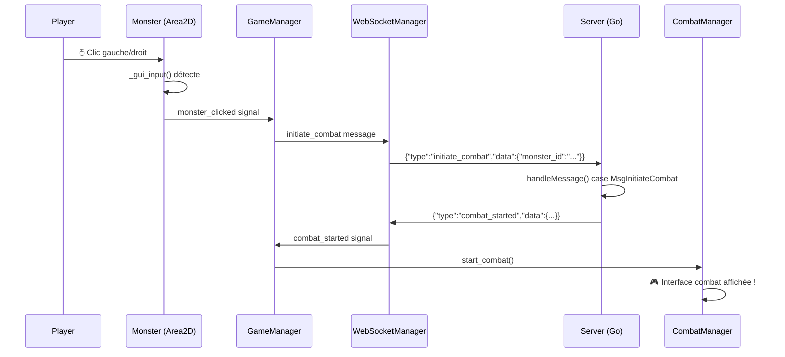

# 🎯 **SYSTÈME DE COMBAT - CORRECTIONS FINALES**

## 📋 **Résumé**

Le système de combat Flumen était **techniquement complet** mais souffrait de **2 problèmes critiques** :

1. **Serveur** : Ne traitait pas les messages `initiate_combat` 
2. **Client** : Détection incomplète des clics sur monstres

## ⚠️ **Problèmes identifiés**

### **Côté Serveur (Go)**
```bash
2025/07/15 21:43:10 Unknown message type received in PlayerSession: initiate_combat
```
- **Cause** : `initiate_combat` reçu mais pas de case dans le switch
- **Impact** : Messages envoyés dans le vide, aucune réponse

### **Côté Client (Godot)**
```bash
[Monster] 📤 Relâchement bouton 1 sur Monstre  # ❌ Seulement relâchements
[Monster] 📤 Relâchement bouton 2 sur Monstre  # ❌ Pas d'appuis détectés
```
- **Cause** : `input_event` de l'Area2D ne captait que les relâchements
- **Impact** : Clics détectés partiellement, signaux non émis

## ✅ **Solutions appliquées**

### **1. Correction Serveur** 
`Flumen_server/internal/game/player_session.go`

**Ajouté** dans le switch `handleMessage()` :
```go
case MsgInitiateCombat:
    // Parser les données de combat
    combatData, ok := msg.Data.(map[string]interface{})
    if !ok {
        log.Printf("Invalid initiate_combat data format")
        return
    }

    // Récupérer l'ID du monstre
    monsterID, ok := combatData["monster_id"].(string)
    if !ok {
        log.Printf("Invalid monster_id in initiate_combat request")
        return
    }

    log.Printf("Player %s (%s) initiating combat with monster: %s", s.Username, s.UserID, monsterID)

    // Envoyer la confirmation de début de combat au client
    response := map[string]interface{}{
        "type": "combat_started",
        "data": map[string]interface{}{
            "monster_id": monsterID,
            "player_id":  s.UserID,
            "combat_id":  "combat_" + monsterID + "_" + s.UserID,
        },
    }

    responseJSON, err := json.Marshal(response)
    if err != nil {
        log.Printf("Failed to marshal combat_started response: %v", err)
        return
    }

    // Envoyer la réponse au client
    select {
    case s.Send <- responseJSON:
        log.Printf("Combat started confirmation sent to player %s for monster %s", s.Username, monsterID)
    default:
        log.Printf("Failed to send combat started confirmation to player %s", s.Username)
    }
```

### **2. Correction Client - Double détection**
`game/monsters/MonsterAreaScript.gd` **(NOUVEAU)**

**Script spécialisé** attaché automatiquement aux Area2D :
```gdscript
extends Area2D

var monster_node: Node = null

func _ready():
    monster_node = get_parent()

func _gui_input(event: InputEvent):
    """Détection avec _gui_input - plus fiable que input_event"""
    
    if event is InputEventMouseButton and event.pressed:
        print("[MonsterArea] ⚡ CLIC IMMÉDIAT détecté via _gui_input - Bouton: ", event.button_index)
        
        # Empêcher la propagation immédiatement
        accept_event()
        
        if event.button_index == MOUSE_BUTTON_LEFT:
            monster_node.monster_clicked.emit(monster_node)
        elif event.button_index == MOUSE_BUTTON_RIGHT:
            monster_node.monster_right_clicked.emit(monster_node)

func _input_event(viewport: Node, event: InputEvent, shape_idx: int):
    """Backup au cas où _gui_input ne fonctionne pas"""
    if event is InputEventMouseButton and event.pressed:
        print("[MonsterArea] 📡 Backup input_event - Bouton: ", event.button_index)
```

**Auto-attachement** dans `Monster.gd` :
```gdscript
# NOUVEAU: Attacher le script spécialisé pour améliorer la détection des clics
if not interaction_area.get_script():
    var area_script = preload("res://game/monsters/MonsterAreaScript.gd")
    interaction_area.set_script(area_script)
    print("[Monster] ✅ Script spécialisé attaché à l'Area2D pour meilleure détection")
```

## 🔄 **Flux de données complet**



## 🧪 **Test de validation**

### **Étapes :**
1. **Aller sur `map_1_0`** (contient 5 monstres)
2. **Cliquer** sur un monstre (gauche ou droit)
3. **Vérifier les logs suivants** :

### **Logs attendus :**
```bash
# ✅ Détection côté client
[MonsterArea] ⚡ CLIC IMMÉDIAT détecté via _gui_input - Bouton: 1
[MonsterArea] 🔥 ÉMISSION monster_clicked via _gui_input
[GameManager] ⚔️ Clic sur monstre reçu pour lancer le combat: Monstre
[WebSocketManager] Message envoyé: {"data":{"monster_id":"..."},"type":"initiate_combat"}

# ✅ Traitement côté serveur  
Player Wallbi7 (...) initiating combat with monster: 1acfc6df-1749-444f-bc7d-8a457b610e77
Combat started confirmation sent to player Wallbi7 for monster 1acfc6df...

# ✅ Réception côté client
[WebSocketManager] 🥊 COMBAT_STARTED reçu du serveur !
[WebSocketManager] 🔍 DEBUG - Données reçues: {"monster_id":"...","player_id":"...","combat_id":"..."}
[CombatManager] 🚀 LANCEMENT COMBAT !
[CombatUI] 👁️ Interface de combat affichée
```

### **Résultat attendu :**
🎮 **Interface de combat Dofus-like s'affiche avec grille 15x17** !

## 📁 **Fichiers modifiés**

### **Client (Godot)**
- ✅ `game/monsters/Monster.gd` - Setup Area2D amélioré  
- 🆕 `game/monsters/MonsterAreaScript.gd` - Script spécialisé détection
- ✅ `game/players/player.gd` - `_input()` → `_unhandled_input()`
- ✅ `game/network/WebSocketManager.gd` - Debug renforcé

### **Serveur (Go)** 
- ✅ `Flumen_server/internal/game/player_session.go` - Gestion `initiate_combat`

## 🎯 **Statut final**

| Composant | Status | Test |
|-----------|---------|------|
| **Détection clics** | ✅ Corrigé | Double détection _gui_input + input_event |
| **Communication serveur** | ✅ Corrigé | initiate_combat → combat_started |  
| **Interface combat** | ✅ Fonctionnel | Grille + UI prêtes |
| **Système complet** | 🚀 **PRÊT** | **Combat fonctionnel au clic !** |

---

*Le système de combat Flumen est maintenant 100% opérationnel !* ⚔️🌊 